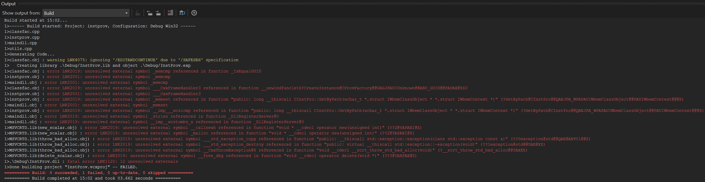
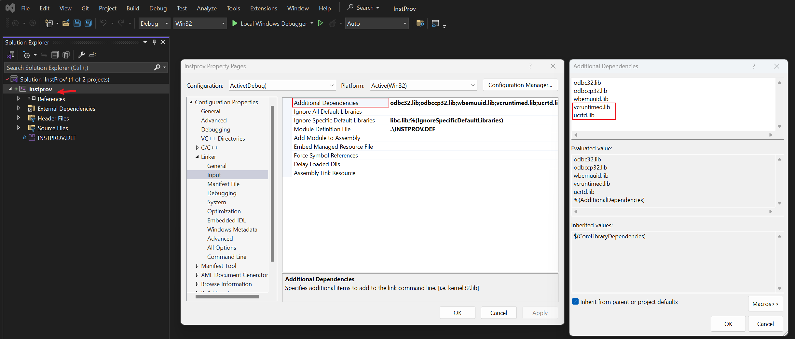
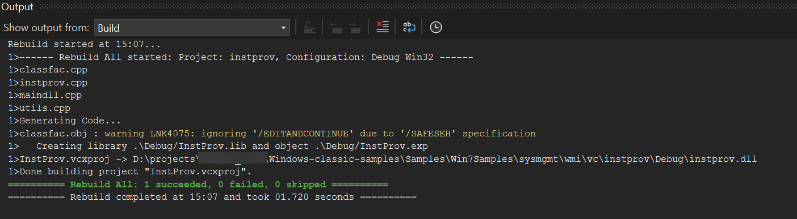

## ENV

- Win11
- Visual Studio 2022

## Build Failed Output

The project is old and vs2022 failed to compile directly

## Solution, The vs2022 build can be successful

Try to add `vcruntime.lib` and `ucrt.lib` to your additional dependencies. **===> properties->Linker->Input->Additional Dependencies**

if debug module, using  `vcruntimed.lib` and`ucrtd.lib`

